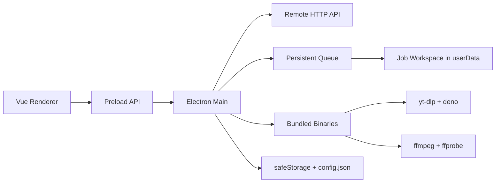

# Архитектура desktop-клиента Video2Book

Дата: 2026-03-18

## 1. Цель и ограничения

Нужен тонкий desktop-клиент для macOS и Windows, который:

- визуально повторяет текущий веб-интерфейс из `docs/client-ui.md`;
- работает только с двумя view: список проектов и список уроков проекта;
- ходит в удалённый сервер по API из `docs/client-api.yaml`;
- локально обрабатывает медиа:
  - скачивает аудио с YouTube;
  - извлекает аудио из локального видео;
  - загружает аудио в API;
- не требует от пользователя отдельно ставить `ffmpeg`, `ffprobe`, `yt-dlp` или JS runtime для `yt-dlp`;
- восстанавливает очередь после аварийного закрытия приложения;
- остаётся простым, без лишних слоёв и тяжёлой инфраструктуры.

Главный вывод: это не “веб-приложение в Electron”, а небольшой desktop shell, где UI живёт в renderer, а вся нативная работа, сеть и очередь живут в main process.

## 2. Принятые решения

### 2.1 Технологический стек

| Зона | Выбор | Почему |
| --- | --- | --- |
| Desktop runtime | `electron` | зрелый runtime, встроенные `safeStorage`, `dialog`, `shell`, IPC |
| Dev/build | `electron-vite` | самый простой способ вести main, preload и renderer в одном Vite-пайплайне |
| Packaging | `electron-builder` | удобная упаковка DMG/NSIS и `extraResources` для бинарников |
| UI | `vue@3` + Composition API + `<script setup lang="ts">` | прямо соответствует UI-спеке |
| Router | `vue-router@4` | нужны только 2 маршрута, роутер достаточно лёгкий |
| Styling | `tailwindcss@4` + `@tailwindcss/vite` | соответствует UI-спеке и текущему стеку |
| API types | `openapi-typescript` | генерирует типы из локального `docs/client-api.yaml` без тяжёлого codegen |
| API client | `openapi-fetch` | тонкая typed-обёртка над `fetch`, без лишнего runtime |

### 2.2 Что сознательно не используем

- Не используем `Pinia`: для двух экранов и одного окна достаточно route-level composables и IPC.
- Не используем `SQLite` и native-модули вроде `better-sqlite3`: они усложняют сборку Electron без реальной пользы для такого объёма данных.
- Не используем `keytar`: для токена достаточно встроенного `safeStorage`.
- Не используем сторонние UI-библиотеки: это прямо запрещено UI-спекой.
- Не делаем auto-update в v1: проект маленький, а лишняя инфраструктура сейчас дороже пользы. Обновление бинарников будет происходить вместе с новой сборкой клиента.

## 3. Платформы и release matrix

Поддерживаем:

- macOS `arm64`
- macOS `x64`
- Windows `x64`

Не поддерживаем в v1:

- Windows `arm64`
- Linux
- universal macOS build

Причина: выбранные бинарные зависимости нормально покрывают macOS Intel/Apple Silicon и Windows x64, а separate build per target упрощает упаковку и снижает риск несовместимых бинарников.

Форматы релиза:

- macOS: `dmg` + `zip`
- Windows: `nsis`

## 4. Бинарники и медиастек

### 4.1 Выбранные пакеты

| Инструмент | Выбор | Роль |
| --- | --- | --- |
| `ffmpeg` + `ffprobe` | `ffmpeg-ffprobe-static` | готовые platform-specific бинарники через npm |
| `yt-dlp` | `yt-dlp-wrap` + скачивание official `yt-dlp` binary в build-step | обёртка и контролируемая загрузка официального бинарника |
| JS runtime для `yt-dlp` | официальный npm-пакет `deno` | `yt-dlp` c конца 2025 требует внешний JS runtime для полноценной работы с YouTube |

### 4.2 Почему именно так

- `ffmpeg-ffprobe-static` проще и надёжнее, чем держать `ffmpeg` и `ffprobe` разными пакетами; при этом он уже рассчитан на desktop packaging.
- Для `yt-dlp` нельзя полагаться на PATH пользователя и нельзя рассчитывать на Python-установку. Поэтому в приложение пакуется официальный `yt-dlp` executable.
- Для новых версий `yt-dlp` нужен внешний JS runtime. Самый предсказуемый вариант для UX — паковать `deno` внутрь приложения и всегда запускать `yt-dlp` с явным `--js-runtimes deno:<path>`.

### 4.3 Версионирование бинарников

Все бинарники должны быть зафиксированы явно:

- версия `ffmpeg-ffprobe-static` — через lockfile;
- версия `deno` — через exact version в `package.json`;
- версия `yt-dlp` — через отдельную константу в build-скрипте `scripts/prepare-binaries.ts`.

Политика: никаких “latest” в runtime.

### 4.4 Как бинарники попадут в инсталлятор

Выбор:

- во время `pnpm install` или `pnpm prepare:binaries` подтягиваем бинарники под текущую платформу;
- складываем их в генерируемую папку `build/bin/`;
- `electron-builder` через `extraResources` копирует `build/bin/*` в packaged `resources/bin/`.

Итог:

- приложение запускает только собственные бинарники;
- пользователь ничего не доустанавливает;
- поведение одинаковое на чистой машине.

### 4.5 Важное ограничение для CI

`ffmpeg-ffprobe-static` скачивает бинарник именно под текущую платформу. Поэтому:

- каждый target собирается в отдельной CI job;
- `node_modules` нельзя переиспользовать между macOS и Windows build;
- перед каждой сборкой нужен чистый install.

## 5. Общая структура проекта

Renderer нужно оставить в структуре из `docs/client-ui.md`, поэтому Electron-код выносим отдельно.

```text
electron/
  main/
    index.ts
    ipc/
      settings.ts
      projects.ts
      lessons.ts
      queue.ts
    services/
      api/
        apiClient.ts
        mappers.ts
      binaries/
        binaryResolver.ts
      config/
        configStore.ts
      queue/
        queueRepository.ts
        queueRunner.ts
        queueEvents.ts
        jobWorkspace.ts
      media/
        youtubeDownloader.ts
        localMediaInspector.ts
        audioTranscoder.ts
        lessonUploader.ts
  preload/
    index.ts
  shared/
    api/
      schema.ts
    dto/
      ipc.ts
      queue.ts

src/
  App.vue
  main.ts
  assets/
  components/
  composables/
  data/
  router/
  types/
  views/

scripts/
  prepare-binaries.ts
  generate-openapi.ts
```

## 6. Границы процессов

### 6.1 Main process

В main process живёт всё, что связано с:

- сетью к удалённому API;
- токеном и URL сервера;
- файловой системой;
- запуском `yt-dlp`, `ffmpeg`, `ffprobe`, `deno`;
- очередью и восстановлением после падения;
- открытием внешних ссылок через `shell.openExternal`.

### 6.2 Renderer process

Renderer отвечает только за:

- отрисовку UI;
- локальное состояние экранов и модалок;
- сбор пользовательского ввода;
- подписку на queue-события;
- отображение ошибок и статусов.

### 6.3 Preload

Preload даёт тонкий типизированный bridge:

- `settings.get()`
- `settings.save()`
- `settings.testConnection()`
- `projects.list()`
- `projects.getLessons(projectId)`
- `lessons.enqueueYoutube(...)`
- `lessons.enqueueYoutubeBatch(...)`
- `lessons.enqueueLocalFile(...)`
- `queue.getSnapshot(projectId?)`
- `queue.onChanged(callback)`
- `shell.openExternal(url)`
- `files.getPathForFile(file)`

`contextIsolation: true`, `nodeIntegration: false` — без исключений.

## 7. Renderer-архитектура

### 7.1 Маршруты

Только два маршрута:

- `/projects`
- `/projects/:projectId`

`/` сразу редиректит на `/projects`.

### 7.2 State management

Выбор: без глобального store.

Используем:

- route-level composables для загрузки данных;
- локальные `ref/shallowRef/computed` в view-компонентах;
- отдельный composable для подписки на queue snapshot.

Почему:

- приложение маленькое;
- тяжёлая логика находится в main process;
- shared state между страницами минимален.

### 7.3 UI-данные

UI сначала делается строго на mock data по `docs/client-ui.md`, а только потом переводится на реальные данные.

Данные из API маппятся в UI-типы из `src/types/ui.ts`. Renderer никогда не работает с “сырым” OpenAPI-ответом напрямую.

## 8. Настройки сервера и токена

Нужен отдельный desktop-specific settings dialog, несмотря на то что его нет в UI-спеке веб-части. Это единственное осознанное отклонение от “полного визуального дубликата”, без которого клиент не сможет работать.

Содержимое настроек:

- `serverUrl`
- `accessToken`

Поведение:

- если настройка отсутствует при первом запуске, сразу открываем settings dialog и блокируем рабочие действия;
- `Проверить подключение` делает `GET /api/folders`;
- при `401` или сетевой ошибке показываем понятную ошибку и предлагаем открыть настройки;
- токен не хранится в renderer.

Хранение:

- обычные поля конфигурации — в JSON-файле внутри `app.getPath("userData")`;
- token — в том же JSON, но шифруется через Electron `safeStorage`;
- если `safeStorage` недоступен, сохраняем это явно в лог и показываем предупреждение только в dev/debug-сценарии, не пользователю.

## 9. API-слой

### 9.1 Выбор

Main process использует:

- сгенерированные типы из `openapi-typescript`;
- `openapi-fetch`;
- нативный `fetch`/`FormData`.

### 9.2 Почему сеть в main, а не в renderer

- токен не попадает в браузерную среду;
- нет CORS-проблем;
- проще объединить upload, очередь и API в одном месте;
- легче делать retry и восстановление после падения.

### 9.3 Маппинг DTO

В main process должен быть тонкий слой маппинга:

- `FoldersResponse -> FolderItem[]`
- `ProjectLessonsResponse -> ProjectScreenData`
- `ProjectLessonCreateResponse -> LessonItem`

Renderer получает уже UI-friendly DTO.

Где `ProjectScreenData` — это составной DTO для страницы проекта:

- `project: ProjectDetails`
- `pipelineVersions: PipelineVersionOption[]`

## 10. Актуальное покрытие API

После последних правок OpenAPI уже покрывает все обязательные данные для двух экранов. Дополнительных блокирующих изменений в API для v1 больше не требуется.

### 10.1 Что теперь покрыто напрямую

- `GET /api/projects/{project}/lessons` теперь возвращает:
  - `project`
  - `lessons`
  - `pipeline_versions`
- `Lesson` теперь содержит `source_url`
- `POST /api/projects/{project}/lessons` возвращает `Lesson` в той же схеме, значит после создания урока не нужен отдельный workaround для source link

Этого достаточно, чтобы:

- наполнять dropdown версии шаблона напрямую из API;
- показывать кнопку перехода на исходник урока на основании `source_url`;
- не делать дополнительный read-request только ради pipeline options.

### 10.2 Что всё ещё остаётся вне API scope

Предупреждение про дубликат YouTube-ссылки в `CreateLessonModal` оставляем как поддерживаемое UI-состояние, но не реализуем в реальном потоке v1, пока API не даст либо:

- endpoint проверки дубликатов по URL;
- либо полный список `source_url` по урокам во всех проектах.

## 11. Очередь и локальная обработка медиа

### 11.1 Базовая модель

Одна глобальная очередь на приложение.

Параллелизм: `1`.

Причина:

- меньше конфликтов за CPU/диск/сеть;
- проще восстановление;
- проще UX;
- для такого клиента скорость важнее предсказуемости, чем голая throughput.

### 11.2 Типы заданий

Каждая запись очереди содержит:

- `id`
- `projectId`
- `lessonName`
- `pipelineVersionId | null`
- `kind: "youtube" | "local-file"`
- `sourceUrl | null`
- `sourceFilePath | null`
- `status: "queued" | "running" | "failed" | "done"`
- `stage: "download" | "transcode" | "upload" | "sync" | null`
- `errorMessage | null`
- `createdAt`
- `updatedAt`
- `workspaceDir`

Batch-вставка списка YouTube-ссылок не отдельный тип очереди, а просто массовое создание нескольких обычных jobs.

### 11.3 Стратегия по типам источника

UI-нюанс: кнопка и модалка по спецификации называются `Добавить урок из аудио`, но в реальном приложении этот сценарий должен принимать и локальные видеофайлы. Название UI сохраняем как в веб-интерфейсе, а обработку делаем по фактическому типу выбранного файла.

#### Локальный аудиофайл

- если это уже допустимый audio-only файл и размер не превышает 100 MB, загружаем как есть;
- если формат не подходит, но аудио можно прочитать локально, перекодируем в MP3.

#### Локальное видео

- через `ffprobe` определяем наличие video stream;
- извлекаем аудио локально через `ffmpeg`;
- итоговый файл — MP3.

#### YouTube

- `yt-dlp` скачивает только аудио;
- сразу приводим результат к MP3;
- затем отправляем аудио в API.

### 11.4 Формат локально произведённого аудио

Выбор: MP3.

Причины:

- гарантированно принимается API;
- совместим с обоими типами входа;
- не требует от сервера разбираться с экзотическими контейнерами.

## 12. Crash-safe persistence

### 12.1 Где хранить состояние

В `app.getPath("userData")`:

```text
userData/
  config.json
  queue/
    state.json
    jobs/
      <job-id>/
        input/
        output/
        meta.json
        stderr.log
```

### 12.2 Как хранить

Выбор: обычный JSON + atomic write.

Правило:

- запись идёт во временный файл;
- затем делается rename;
- main process обновляет snapshot после каждого важного перехода job.

Этого достаточно, потому что:

- объём очереди небольшой;
- нужен простой формат;
- чтение/восстановление должно быть прозрачным и отлаживаемым.

### 12.3 Восстановление после падения

При старте приложения:

- читаем `state.json`;
- все job в `running/*` переводим обратно в `queued`;
- поднимаем worker;
- продолжаем с первой незавершённой записи.

Уточнение по “продолжать с того места, где остановились”:

- для `yt-dlp` используем один и тот же workspace и включаем continuation/reuse temp files;
- для `ffmpeg` если финальный MP3 уже существует, шаг transcode пропускается;
- если приложение упало на upload, уже готовый MP3 переиспользуется и upload просто повторяется.

То есть восстановление идёт не по байтовому offset любой операции, а по устойчивым stage boundary. Для этого проекта это наилучший баланс простоты и надёжности.

## 13. Как очередь отображается в UI

Проблема: API создаёт урок только после фактической загрузки аудио, а пользователь должен видеть новый элемент сразу после добавления задачи.

Принятое решение:

- renderer получает queue snapshot по текущему проекту;
- на странице проекта локальные queue jobs мержатся с уроками из API;
- для локальных job рисуются временные “placeholder lessons” с отрицательными или строковыми local IDs;
- статусы отображаются в уже существующих полях UI:
  - `queued`
  - `running`
  - `failed`
  - `loaded` после успешного появления реального урока с сервера

После успешного `POST /api/projects/{project}/lessons`:

- main process возвращает созданный урок;
- renderer заменяет placeholder реальной записью;
- затем делает фоновый refresh project lessons.

Это лучший UX без добавления третьего экрана “Downloads”.

## 14. Работа с файлами из renderer

UI-спека уже предполагает обычный `<input type="file">` и dropzone. Это оставляем.

Путь к выбранному файлу получаем через preload:

- renderer передаёт `File`;
- preload использует Electron `webUtils.getPathForFile(file)`;
- main получает только filesystem path, а не blob целиком.

Так мы:

- не копируем большой видеофайл через IPC;
- не ломаем `contextIsolation`;
- сохраняем обычный вебовый UX выбора файла.

## 15. Packaging и release-правила

### 15.1 Что обязательно попадает в packaged app

- `ffmpeg`
- `ffprobe`
- `yt-dlp`
- `deno`

Все пути резолвятся через `process.resourcesPath`.

### 15.2 Code signing

Для production-релизов это обязательно:

- macOS: подписываем и нотаризуем сборку;
- Windows: подписываем инсталлятор и приложение.

Без этого на обеих платформах пользовательский опыт установки будет хуже, чем должен быть у desktop-клиента.

### 15.3 Лицензии

Нужно заранее учесть, что `ffmpeg-ffprobe-static` тянет GPL-бинарники. Поэтому перед публичной дистрибуцией надо:

- добавить `THIRD_PARTY_LICENSES`;
- проверить требования по распространению FFmpeg-сборок;
- не выпускать публичный installer без этого шага.

## 16. Что остаётся вне scope v1

- auto-update приложения;
- изменение/удаление задач из очереди;
- пауза/resume кнопками;
- отдельный download manager screen;
- кросс-проектный поиск дубликатов YouTube;
- дополнительные view сверх двух обязательных;
- любые UI-отклонения от `docs/client-ui.md`, кроме settings dialog.

## 17. Итоговая архитектурная схема



## 18. Источники выбора

- [Electron `safeStorage`](https://www.electronjs.org/docs/latest/api/safe-storage)
- [Electron `webUtils.getPathForFile`](https://www.electronjs.org/docs/latest/api/web-utils)
- [electron-vite features](https://electron-vite.org/guide/features)
- [electron-builder overview](https://www.electron.build/)
- [electron-builder `extraResources`](https://www.electron.build/contents.html)
- [electron-builder macOS signing](https://www.electron.build/code-signing-mac.html)
- [electron-builder Windows signing](https://www.electron.build/code-signing-win.html)
- [Tailwind CSS v4 + Vite plugin](https://tailwindcss.com/docs/installation/framework-guides/laravel/vite)
- [openapi-typescript](https://openapi-ts.dev/introduction)
- [openapi-fetch](https://openapi-ts.dev/openapi-fetch/)
- [ffmpeg-ffprobe-static](https://www.npmjs.com/package/ffmpeg-ffprobe-static)
- [yt-dlp-wrap](https://github.com/foxesdocode/yt-dlp-wrap)
- [yt-dlp: external JS runtime announcement](https://github.com/yt-dlp/yt-dlp/issues/15012)
- [yt-dlp EJS setup](https://github.com/yt-dlp/yt-dlp/wiki/EJS)
- [Deno installation docs](https://docs.deno.com/runtime/manual/getting_started/installation)
